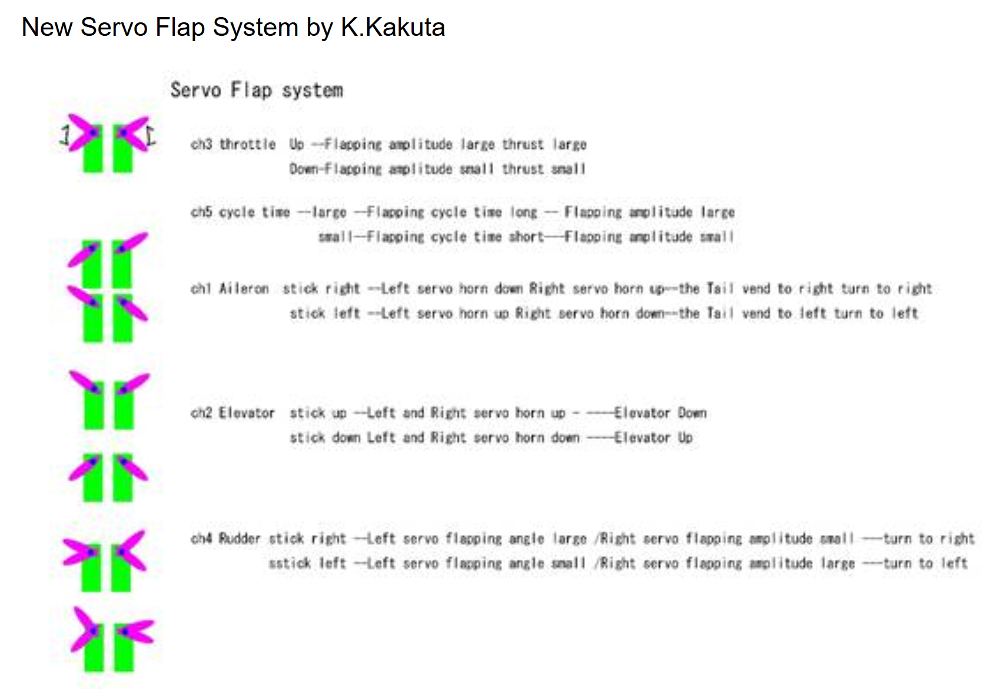

# Simple stc flutter controller

It mainly converts the ppm signal of Sky 9 into pwm signal and controls the wing. The operation idea mainly uses from 

## stc8g1k08a gpio

```c
gpio_init(3, 2, GPIO_PullUp); // PPM input
gpio_init(3, 3, GPIO_OUT_PP); // PWM0
gpio_init(5, 5, GPIO_OUT_PP); // PWM1
```

## build&install

```shell
sudo apt install -y cppcheck sdcc cmake
# Modify "/dev/ttyS3", I'm using wsl1, so just change the port number.
./rebuild.sh
```